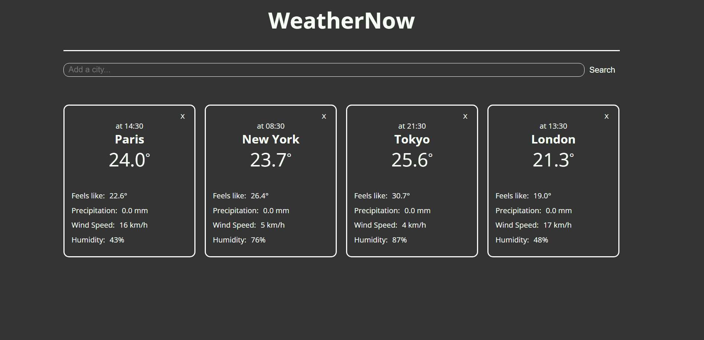
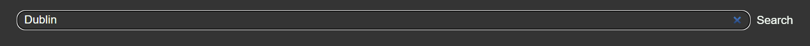
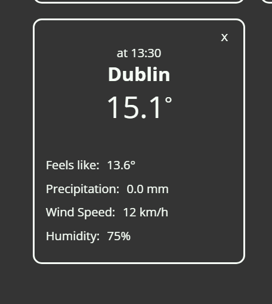

# WeatherNow

Version 1.0
*author: aurelienb16*

WeatherNow is a minimalist web app to fetch data about the weather in about any place around the globe. Simply enter the name of a city in the search bar, and let the API fetch the data for you.

#### Tech Stack

- Vite
- JavaScript (API Requests)
- HTML, CSS
- React
- OpenMeteo API

#### Screenshots

Upon opening, the app will display live data for various megacities.



Use the search bar to add any city of your liking!





Click on the `X` in the top right corner to remove a city from the list.

#### Features

- **UI**: the service is conveniently accessible from any web browser, with a minimalistic design to keep the interface smooth and easy to navigate. 
- **Search & Delete**: the user can add and remove any city around the globe from the panel.
- **Auto-Refresh**: the data is refreshed every 30 seconds to avoid deprecated data.

Due to API limitations, the current weather is only updated every 15 minutes.

#### Architecture Overview

The app is built with React, powered by Vite.

In the first version, four components are used: 

- CitySearchBar: processes the user's search and adds the city to the list.

- Header: a stateless decorative component for the page header

- WeatherPanel: fetches and displays information for its associated city.

The main component App handles the `cities` and location `states` via the function *useState* of React. The API calls are processed using the function `useEffect` of React to handle the async functions. The App component provides two functions (`removeCity` and `addCity`) to its children allowing them to update the state of city.

The API calls are managed in a separate directory (`api/`). The app uses the OpenMeteo API (free to use, no key required) to fetch both the weather data and the city geocoding data (to convert a city name to geographic coordinates).

#### How to Use

After downloading the files, in the project root directory, open a terminal. Use the following command:

```bash
npm install
```

To run the project as a development live server: 

```bash
npm run dev
```

Then open any web browser and navigate to `http://localhost:5173/`.

To build the bundle, run the following command:

```bash
npm build
```

You will find the bundle in the `dist/` directory of the project. Open the `index.html` file to run it.

#### Limitations

No forecast data shown yet.

In future versions, the user should be able to choose the data to be displayed.

#### Contact

Aurélien Bithorel

IT Student in University of Lille, France

au.bithorel@gmail.com

#### Attributions

WeatherNow Icon (Flaticon): https://www.flaticon.com/free-icons/weather